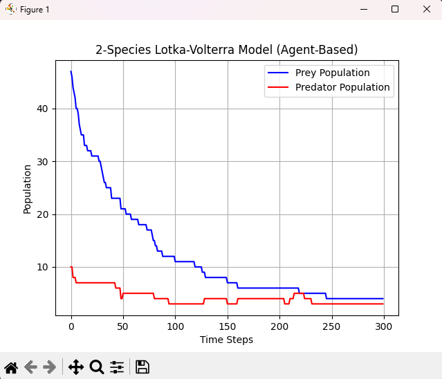
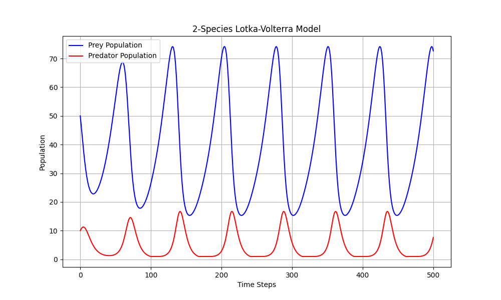
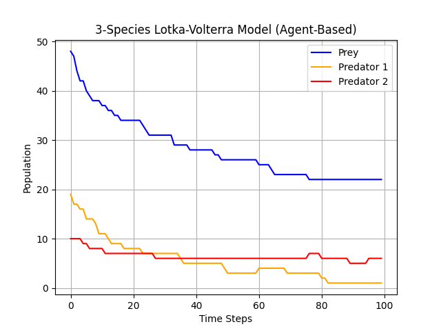
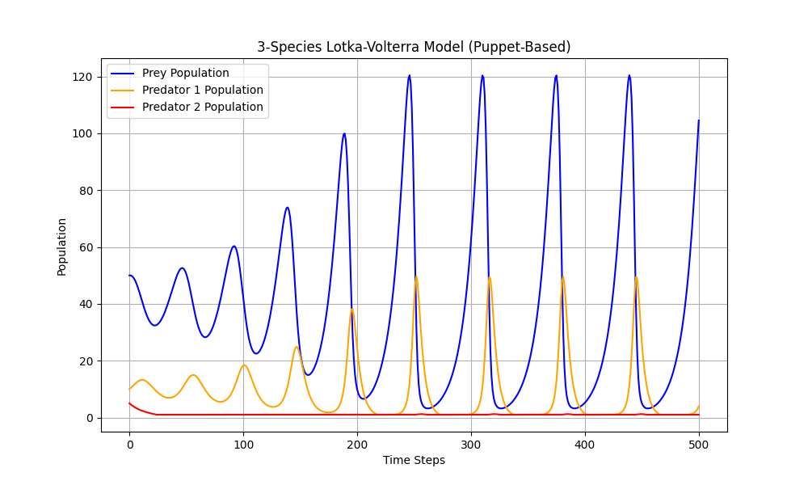
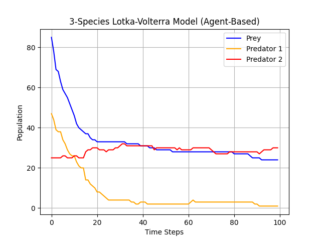
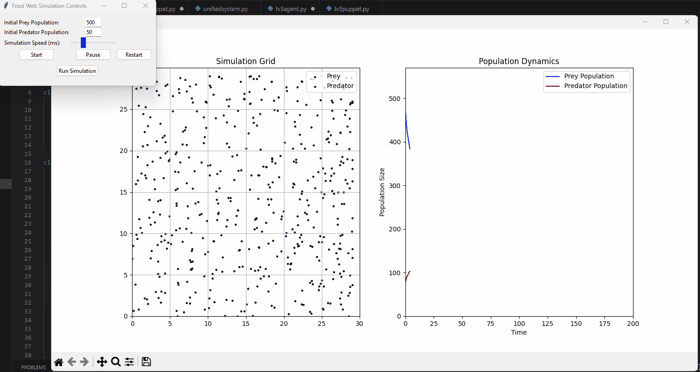

# Lotka-Volterra Food Web Simulation

This repository contains agent-based and puppet-based simulations of 2-species and 3-species Lotka-Volterra (L-V) food web models. These models simulate the oscillatory behavior in an ecosystem with predator-prey dynamics and demonstrate how populations fluctuate over time within a stable food web.

## Table of Contents

- [Overview](#overview)
- [Simulation Models](#simulation-models)
  - [2-Species Lotka-Volterra Model](#2-species-lotka-volterra-model)
  - [3-Species Lotka-Volterra Model](#3-species-lotka-volterra-model)
  - [Unified System](#unified-system)
- [Usage](#usage)
- [Requirements](#requirements)
- [File Descriptions](#file-descriptions)
- [Results](#results)
  - [GIF Demo](#gif-demo)
  - [Images](#images)
- [References](#references)

## Overview

The Lotka-Volterra equations describe predator-prey dynamics, modeling how the population of species interact in an ecosystem. This project extends the standard 2-species L-V model to a 3-species model and includes both **agent-based** and **puppet-based** versions. The goal is to observe stable oscillatory dynamics across species populations.

In the 3-species model:
- **Prey** serves as food for **Predator 1**.
- **Predator 1** preys on **Prey** and is itself consumed by **Predator 2**.
- **Predator 2** sits at the top of the food chain, feeding on **Predator 1**.

## Simulation Models

### 2-Species Lotka-Volterra Model

This model simulates the interaction between **Prey** and **Predator 1**. Both an agent-based and puppet-based version are implemented to show different modeling approaches.

#### Agent-Based Version

#### Puppet-Based Version

### 3-Species Lotka-Volterra Model

This model extends the 2-species model by adding **Predator 2**, creating a 3-level food web with more complex dynamics. Both agent-based and puppet-based versions are implemented for this model as well.

#### Agent-Based Version

#### Puppet-Based Version

### Unified System

The `unifiedsystem.py` script provides a GUI-based simulation interface where users can adjust parameters dynamically for the unified 2-species and 3-species models.

## Usage

1. **Run simulations**:
   - To run the **agent-based** 2-species or 3-species simulation, use `lv2agent.py` or `lv3agent.py` respectively.
   - To run the **puppet-based** 2-species or 3-species simulation, use `lv2puppet.py` or `lv3puppet.py`.
   - For a **unified system** with interactive controls, use `unifiedsystem.py`.
2. **Customize parameters**: Each script allows for adjusting parameters like birth rates, death rates, and energy gains to explore different dynamic behaviors.
3. **Visualize**: The simulation plots population dynamics over time and displays results on a grid.

## Requirements

- Python 3.x
- Matplotlib
- Tkinter (for the unified simulation interface)

## File Descriptions

- **`lv2agent.py`**: Agent-based simulation for the 2-species Lotka-Volterra model.
- **`lv2puppet.py`**: Puppet-based simulation for the 2-species Lotka-Volterra model.
- **`lv3agent.py`**: Agent-based simulation for the 3-species Lotka-Volterra model.
- **`lv3puppet.py`**: Puppet-based simulation for the 3-species Lotka-Volterra model.
- **`unifiedsystem.py`**: Unified simulation system with a GUI for setting parameters and starting/stopping simulations.
- **`Simulator.gif`**: GIF demo showing the real-time simulation interface.
- **Images** (`2lvAgent.png`, `2lvPuppet.png`, `3lvAgent.png`, `3lvPuppet.png`, `UAgent.png`): Visual representations of the different models and their results.

## Results

### GIF Demo

### Images

Below are the population dynamics plots for each model variant:

#### 2-Species Model

- **Agent-Based** 
- **Puppet-Based** 

#### 3-Species Model

- **Agent-Based** 
- **Puppet-Based** 

#### Unified System

## References

For a deeper understanding of Lotka-Volterra equations and multi-dimensional food web models, refer to:

- Generalized Lotka-Volterra Equations for sustainable food webs: [PLoS Computational Biology](https://journals.plos.org/ploscompbiol/article?id=10.1371/journal.pcbi.1004727)
- Multi-dimensional Lotka-Volterra food web models: [University of Illinois](https://math.illinois.edu/research/igl/projects/spring/2018/analysis-multidimensional-lotka-volterra-food-web-models)

---

This README provides an overview of the project, descriptions of the simulation files, and visual demos for each model. Adjustments can be made based on specific research needs or user preferences.
